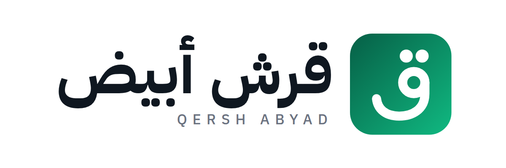

# قرش أبيض

> القرش الأبيض ينفع في اليوم الإسود

(اسمه القديم «مصاريفي».)

تطبيق ويب (PWA) لإدارة فلوسك. يشتغل أوفلاين، والبيانات كلها على الموبايل في IndexedDB — مفيش سيرفر ومفيش حساب.

## الجديد في نسخة 4

### تصليحات من بيانات حقيقية
- **البند الثابت**: لو غيّرت تصنيفه أو مبلغه أو حسابه، التطبيق بيسألك تغيّر كمان اللي اتسجل منه الشهر ده.
- **العلامات المخفية** اللي كيبورد الآيفون بيحطها في أول الملاحظة اتشالت، من اللي هتسجله ومن اللي اتسجل قبل كده. دي كانت بتبوّظ اختيار التصنيف من الكلمات.
- **المقارنة بالشهر اللي فات** والمتوسط بيستخدموا بس الشهور اللي اتسجل فيها 5 مصاريف على الأقل. شهر فيه فاتورة واحدة اتسجلت بعدين مش مقياس.

### تقارير أوضح
- **«الخلاصة»** فوق في التقارير: الشهر في جمل عادية، زي «دخلك 15,000 وصرفت 5,682، يعني فضل معاك 9,318. أكتر حاجة صرفت عليها فواتير: 2,756 (49%). فاضل من ميزانيتك 3,318، يعني حوالي 123 في اليوم لآخر الشهر.»
- **زرار «؟»** جنب عنوان كل كارت (في التقارير والمحفظة والإيجارات)، بيشرح الرقم معناه إيه بأرقامك انت.
- **أقل زحمة**: ظاهر بس الرقم الكبير، والخلاصة، والتنبيهات، والميزانية، ومصاريفك المعتادة، والمصاريف بالتصنيف. الباقي تحت **«📊 تفاصيل أكتر»**، والتطبيق بيفتكر هو مفتوح ولا مقفول.
- **مقارنة عادلة**: الشهر الحالي بيتقارن بنفس الأيام من الشهر اللي فات (1–5 قصاد 1–5)، مش بالشهر كله.
- **توقع آخر الشهر** = اللي صرفته + باقي الشهر بمعدلك العادي. ومش بيظهر غير لما يبقى فيه بيانات كفاية.

### 🧠 مصاريفك المعتادة واقتراح ميزانية
في التقارير (الشخصي، الشهر الحالي):
- **المعتاد في الشهر**: متوسط مصاريفك في آخر 6 شهور كاملة. أول شهر لو بدأت التطبيق في نصه مش بيدخل في المتوسط. ولو لسه مفيش شهر كامل، بيعمل تقدير بعد أسبوع من التسجيل.
- **الشهر ده متوقع يقفل على كام**: اللي صرفته لحد دلوقتي + باقي الشهر بمعدلك العادي، علشان مشتريات كبيرة في أول الشهر ما تتضربش في عدد الأيام.
- **بنود ماشية أعلى من المعتاد**، مثلاً «أكل وشرب صرفت 1,500 لحد دلوقتي — متوقع يقفل على 3,597 والمعتاد 2,500».
- **اقتراح توفير** من أكبر بند كماليات: «لو قللت 15% هتوفّر X في الشهر — Y في السنة».
- **«اقترح ميزانية لكل بند»**: البنود الأساسية بالمعتاد، والكماليات أقل 10%. تقدر تعدّل أي رقم وتشيل أي بند، وبعد ما تحفظ التطبيق بينبهك وقت التسجيل لو قرّبت من الحد أو عدّيته. وتقدر كمان تخلّي ميزانية الشهر كله = المجموع.

### رقم النسخة وزرار التحديث
الإعدادات ← التطبيق: بيكتب رقم النسخة اللي على الموبايل، ولو فيه نسخة أحدث على الموقع بيقولك. زرار **«🔄 حدّث التطبيق دلوقتي»** بيجيب آخر نسخة على طول، من غير ما تقفل التطبيق وتفتحه. بياناتك ما بتتلمسش. ولو نزلت نسخة جديدة والموبايل لسه على القديمة، التطبيق بيعرض «فيه تحديث جديد» مع زرار «حدّث».

### المحفظة: اختار اللي عايز تشوفه
فوق في المحفظة ← حسابات فيه اختيارات: **الكل · الكاش · البنك والكروت · العملات**، وكمان كل حساب لوحده.
- «الكاش» أو «البنك» بيوريك مجموعهم ونسبتهم من فلوسك.
- لو اخترت **حساب واحد** بيوريك رصيده، و**صرفت منه كام في الشهر اللي تختاره، مقسم بالتصنيف** (من غير التحويلات والسلف)، ومقارنة بالشهر اللي قبله، والدخل اللي نزل فيه، وكل حركاته في الشهر ده. دوس على أي حركة علشان تعدّلها.
- التطبيق بيفتكر اختيارك.

### فلوس بعملات تانية (دولار، يورو…) (احترافي)
المحفظة ← حسابات ← **«💱 فلوس بعملة تانية»**: اختار العملة، واكتب سعرها النهاردة والمبلغ اللي معاك **بعملته**.
- الحساب بيظهر «1,980 € ≈ 108,900 ج»، وقيمته بالجنيه داخلة في «إجمالي فلوسك».
- **السعر في مكان واحد**: عدّله من الحساب نفسه أو من الإعدادات ← العملات، وكل حاجة تتحسب بيه.
- **شراء أو تغيير عملة**: من الحساب ← «اشتريت / حطيت فيه» أو «غيّرت / خدت منه»، أو تحويل عادي من شاشة التسجيل. بتكتب دفعت كام وخدت كام، والتطبيق يقولك السعر اللي اتعاملت بيه، ولو مختلف يعرض إنه يبقى السعر الجديد. ده تحويل بين حساباتك، مش دخل ولا مصروف.
- **الصرف منه**: اختار الحساب في التسجيل واكتب المبلغ بعملته (20 €)، والمصروف بيدخل التقارير بالجنيه بسعر اليوم.
- **«زادت / قلّت»**: جنب كل حساب، الفرق بين قيمته دلوقتي بالجنيه واللي دفعته فيه.
- السلف والحجوزات والإيجارات والآجل بتتعامل بحسابات الجنيه بس.

### كلام أبسط
الكلمات الصعبة اتغيرت لكلام عادي: «تسوية» بقت «عدّ الفلوس»، «الرصيد الافتتاحي» بقى «الرصيد اللي بدأت بيه»، «ملتزم/اختياري» بقوا «أساسي/كماليات»، «إشغال» بقى «متأجرة X% من الشهر»، و«المستحق» بقى «مواعيد دفع وتحصيل».

### تعديل دفعة في الحجز
دوس على أي دفعة في الحجز علشان تغيّر مبلغها أو يومها أو الحساب اللي وصلت فيه، من غير ما تمسحها وتكتبها تاني. الدفعة بتفضل في مكانها في السجل، ولو كانت «قبل التطبيق» بتفضل كده.

### تأكيد لو يوم الوصول اتغيّر
لو غيّرت يوم الوصول أو عدد الليالي في حجز قديم، التطبيق بيسألك الأول، علشان التاريخ ما يتغيّرش بالغلط.

### ربط مصاريف قديمة بوحدة
المحفظة ← إيجارات ← الوحدات ← دوس على الوحدة ← «🔗 اربط مصاريف قديمة». بتعلّم المصاريف اللي كانت للشقة وهي متسجلة شخصي، فتتخصم من مكسب الوحدة وتخرج من مصاريفك. المصاريف اللي في ملاحظتها اسم الوحدة بتبقى متعلّمة لوحدها.

### الشخصي والإيجارات منفصلين (احترافي)
- **التقارير** فيها اختيار فوق: **شخصي · 🏘 الإيجارات · الكل**. «شخصي» هو الافتراضي، وبيشيل أي حاجة تابعة للإيجارات: دفعات الحجوزات، الإيجار الشهري، وأي مصروف متعلّم «تابع لوحدة».
- **الميزانية وتنبيه الشذوذ و«أساسي وكماليات» و«متاح النهاردة»** بيتحسبوا على فلوسك الشخصية بس. مصروف نظافة الشقة مش هيعدّي ميزانية أكلك، ولو الميزانية «= الدخل المسجّل» فدخل الشقة مش بيكبّرها.
- **تقرير الإيجارات** بيوريك رقمين جنب بعض: **«اللي وصلك»** (الفلوس اللي دخلت وخرجت الشهر ده) و**«المفروض يدخل»** (اللي الشهر يستاهله حسب الليالي والعقود، حتى لو الفلوس ما وصلتش). وبيقولك ليه الرقمين مختلفين: عرابين لحجوزات جاية، أو ليالي لسه ما اتدفعتش، أو إيجار متأخر، أو عمولات، أو مبالغ رجعت لضيوف.
- **السجل**: التصفية فيها «شخصي بس / الإيجارات بس»، والـCSV فيه عمودين جداد: شخصي أو إيجارات، والوحدة.
- **تقرير PDF**: فيه خلاصة (شخصي / إيجارات / الكل)، وتصنيفات المصاريف والدخل الشخصية بس، وجدول لكل وحدة فيه المستحق واللي اتحصّل والمصاريف والمكسب بالطريقتين.

### الوحدات (احترافي)
- الوحدة بقت حاجة لوحدها بدل ما تكون اسم مكتوب بس. في المحفظة ← إيجارات ← «الوحدات» تقدر تزوّد وحدة، أو تغيّر اسمها (الحجوزات والعقود والمصاريف كلها بتتغيّر معاها)، أو تقفلها.
- **العقود الشهرية بقت متربطة بالوحدات**: إيجارها بيدخل في «مكسب كل وحدة»، وتقدر تربط مصاريف على شقة مأجّرة شهري، حتى لو لسه مفيهاش أي حجز.
- **الإشغال** بيتحسب على الوحدات اللي كانت بتستقبل ضيوف في الشهر ده بس. زيادة وحدة جديدة مش بتقلّل إشغال الشهور اللي فاتت.
- البيانات القديمة بتتنقل لوحدها: كل اسم وحدة بيبقى وحدة، ودخل الحجوزات والعقود القديم بيتعلّم إنه تابع للإيجارات.

### بوكينج «الدفع في الشقة»
علّم «الضيف بيدفع المبلغ كله في الشقة، والمنصة بتطالبني بالعمولة بعدين»، وبعدها تقدر تسجّل المبلغ اللي قبضته كله. العمولة بتظهر «مستحقة» في الحجز وفي «مواعيد دفع وتحصيل» من يوم المغادرة. ولما تدفعها علّم «دفعت العمولة» في الحجز، وهتتسجل مصروف على الوحدة.

### شراء أو تصليح آجل (احترافي)
في التسجيل دوس (✎) وعلّم «🧾 آجل»، واكتب لمين (المحل أو الصنايعي) وهتدفع إمتى.
- المصروف **بيتحسب يوم الشراء أو التصليح** في التقارير والميزانية، ولو اخترت «تابع لوحدة» بيتخصم من مكسبها في نفس الشهر.
- **الرصيد مش بيتحرك** غير لما تدفع فعلاً. تدفع مرة واحدة أو جزء جزء، من أي حساب. الدفعات بتحرّك الرصيد بس، ومش بتتحسب مصروف تاني.
- اللي عليك بيظهر في المحفظة ← «سلف وآجل»، وداخل في «عليّ للناس»، وفي «مواعيد دفع وتحصيل» قبل ميعاد الدفع بأسبوع، وفي السجل كسطر «سداد آجل» يوم الدفع.

### إلغاء الحجز
في الحجز ← «✕ الضيف لغى الحجز»: بتكتب المبلغ اللي رجّعته للضيف (أو 0 لو العربون مش مسترد). الليالي بتفضى في التقويم، واللي فضل معاك بيتحسب دخل الوحدة في شهر الإلغاء. وتقدر ترجّع الحجز تاني من نفس المكان.

### تحويلات المنصات
حجوزات Airbnb وبوكينج اللي المنصة بتحوّل فلوسها مش بتظهر «متأخر» يوم وصول الضيف. بتظهر بس لو التحويل ما وصلش بعد المغادرة بأسبوعين.

### إصلاح: الكيبورد
الصفحة عربية RTL، فالشبكة كانت بتقلب الأرقام و«١» كان بيظهر على اليمين. اتظبط بـ `direction:ltr` على الكيبورد بس — دلوقتي `1 2 3` من الشمال لليمين زي أي موبايل.

### وضعين
- **بسيط** — تسجيل مصروف ودخل، تصنيفات، ميزانية، تقارير. ٤ أيقونات تحت.
- **احترافي** — كل اللي تحت + تاب «محفظة». ٥ أيقونات.

التبديل من الإعدادات في أي وقت. مفيش بيانات بتضيع لما ترجع لبسيط — بتتخفي وبس.

### ليلي / نهاري / تلقائي
لوحة ألوان كاملة للوضعين. «تلقائي» بيمشي مع إعداد النظام. لون شريط الحالة بيتغير معاه.

### حسابات بأرصدة (احترافي)
كل حساب بنوعه (كاش / بنك وكارت) ورصيد افتتاحي ورصيد جاري محسوب. شاشة التسجيل بتوريك **إجمالي فلوسك**، والمحفظة بتفصّل كاش مقابل بنك. الحساب اللي عليه حركات بيتقفل مش بيتحذف.

### تحويلات ومرتجعات (احترافي) — دي كانت ثغرة حقيقية
- **تحويل**: سحب من ATM أو تحويل بين حسابات. بيحرّك الأرصدة بس مش بيتحسب دخل ولا مصروف. من غيره كانت تسوية الكاش بتقول لك «معاك زيادة» على فلوس كانت معاك أصلاً.
- **مرتجع**: بيخصم من تصنيف المصروف بدل ما يتسجل دخل ويلخبط رقم دخلك.

### تسجيل بجملة
زر ⌨ — اكتب `50 أكل كاش` أو `20000 مرتب فيزا` وهو يفهمها. بيفهم الأرقام العربية (٥٠) و«أل» التعريف وأشكال الألف المختلفة، وبيحط الباقي ملاحظة.

### تصنيف تلقائي بالكلمات
كل تصنيف ليه قايمة كلمات — `شاورما`، `قهوة`، `كارفور` ← أكل وشرب، `اوبر`، `بنزين` ← مواصلات، `كهربا`، `كارت شحن` ← فواتير، `صيدلية`، `دكتور` ← صحة، وهكذا لكل التصنيفات الافتراضية. اكتب `50 شاورما` في «تسجيل بجملة»، أو اكتب «شاورما» في الملاحظة من الكيبورد، والتصنيف يتختار لوحده (الكلمة بتفضل في الملاحظة). لو انت دوست على تصنيف بإيدك، الملاحظة مش بتغيّره. تقدر تزوّد أو تشيل كلمات من الإعدادات ← دوس على التصنيف ← «كلمات بتختار التصنيف ده لوحدها».

### مصاريف قادمة (احترافي)
اللي انت عارف إنه جاي — مدارس، تأمين، قسط. بيتحجز من «متاح النهاردة» فالرقم يبقى صادق. وزر «اتدفع» بيحوّله لمصروف فعلي من الحساب اللي تختاره.

### أساسي وكماليات
كل تصنيف مصروف بتعلّمه أساسي (ما ينفعش تستغنى عنه) أو لأ. التقرير بيقول لك: «لو استغنيت عن الكماليات تقدر توفّر لحد X». أنفع من تقسيمة التصنيفات لوحدها.

### تنبيه شذوذ (احترافي)
«أكلك أعلى ٤٠٪ من متوسط آخر ٦ شهور». بيقارن بالشهور اللي فيها بيانات فعلاً (٣ شهور على الأقل) ومش بيتكلم غير لما الفرق يبقى معتبر.

### دفتر إيجارات (احترافي)
الساكن والوحدة والإيجار ويوم الاستحقاق. شبكة ١٢ شهر تدوس على الشهر لما تتحصّل — وبيعرض عليك يسجّله دخل على الحساب اللي استلمته فيه، بتاريخ اليوم اللي استلمته فيه. لو رجّعت الشهر غير محصّل، الدخل اللي اتسجل بيتمسح معاه. بيحسب المتأخر والمحصّل.

### تسوية أي حساب
التسوية بقت تشتغل على أي حساب مش الكاش بس، وبتحترم التحويلات.

### تنبيه الميزانية وقت التسجيل
لما مصروف يوصّل تصنيفه لـ ٨٠٪ من ميزانيته أو يعدّيها، رسالة التسجيل بتقولك على طول — «أكل وشرب: عدّيت الميزانية بـ 320». ونفس الكلام لميزانية الشهر كلها. وبينبّهك مرة واحدة بس عند كل حد.

### المستحق (احترافي)
تحت التاريخ في شاشة التسجيل: «⚠ ٢ متأخر · ١ قريب». دوسة عليها بتوريك السلف اللي موعدها فات أو جاي خلال أسبوع، والمصاريف القادمة، والإيجارات اللي لسه متحصّلتش — وكل واحدة بتفتح تفاصيلها.

### حجوزات بالليلة (احترافي)
في المحفظة ← إيجارات: لكل حجز الوحدة والضيف ويوم الوصول وعدد الليالي والإجمالي، والمصدر (بوكينج، Airbnb، أو مباشر) وعمولة المنصة. كل دفعة بتوصلك — عربون، أو الباقي يوم الوصول، أو تحويل المنصة — بتسجلها في الحجز بمبلغها ويومها والحساب اللي نزلت فيه (المنصات افتراضياً على البنك، والمباشر على الكاش)، وبتتسجل دخل لوحدها. الحجز بيوريك «اتدفع ٥٠٠ · فاضل ٤٠٠٠» لحد ما يكمل. ولو الدفعة وصلت قبل ما تبدأ تستخدم التطبيق، بتعلّم إنها موجودة في رصيدك الافتتاحي فمتتحسبش مرتين. ملخص كل شهر: صافي الحجوزات، الليالي والإشغال، العمولات، والتقسيمة حسب المصدر — والحجز اللي بيعدّي آخر الشهر بيتقسم على الشهرين بعدد لياليه.

### للحجوزات كمان
- **تنبيه حجز مكرر**: لو الوحدة محجوزة في نفس الليالي، التطبيق بيسألك قبل ما يحفظ.
- **تقويم**: الشهر قدامك وكل وحدة بلونها. يوم فاضي ← حجز جديد بتاريخه، يوم محجوز ← يفتح الحجز.
- **مكسب كل وحدة**: في تفاصيل المصروف (✎) اختار «تابع لوحدة» — النظافة والكهربا والصيانة بتتخصم من دخل الوحدة، ومش بتتحسب من مصاريفك الشخصية. المكسب بيظهر بالطريقتين: المفروض يدخل واللي وصلك.
- **تذكير الوصول**: الضيف الواصل خلال ٣ أيام وعليه باقي بيظهر في «مواعيد دفع وتحصيل».
- **واتساب**: موبايل الضيف في الحجز، وزرار يبعتله رسالة تأكيد فيها المواعيد والمدفوع والباقي.

### التطبيق بيتعلّم منك
لو اخترت تصنيف بإيدك لملاحظة الكلمات مكانتش بتوديها له، التطبيق بيفتكر الملاحظة كلمة للتصنيف ده — المرة الجاية بيختاره لوحده.

### بالصوت
زر المايك في «تسجيل بجملة» — قول «خمسين أكل كاش». التطبيق بيفهم المبالغ بالكلام: «خمسة وعشرين»، «ميتين وخمسين»، «ألف ونص»، «تلات آلاف». الآيفون مش بيسمح لتطبيقات الشاشة الرئيسية تستخدم التعرّف على الصوت، فالتطبيق بيقولك كده ويوديك لـ 🎤 اللي في الكيبورد — وده شغال دايماً وبيكتب في نفس الخانة.

### محافظ ورسوم تحويل
حساب جديد فيه اختيار سريع: إنستاباي، فودافون كاش، اتصالات كاش، أورنج كاش، البنوك. وفي التحويل تقدر تكتب الرسوم من تفاصيل (✎) — بتتسجل مصروف من الحساب اللي حوّلت منه.

### قفل التطبيق
الإعدادات ← الأمان: رقم سري ٤ أرقام، وكمان Face ID / البصمة لو الموبايل بيدعمها. بيقفل لما تفتح التطبيق أو لو سبته أكتر من دقيقة. القفل بيخبّي التطبيق بس، مش بيشفّر البيانات — ولو نسيت الرقم مفيش طريقة ترجّعه.

### تقرير PDF
التقارير ← «📄 تقرير PDF»: الدخل والمصاريف بالتصنيف، الحسابات، الحجوزات ومكسب كل وحدة، الأهداف، وكل حركات الشهر. على الآيفون: مشاركة ← حفظ في Files.

### أهداف الادخار
في التقارير: هدف بمبلغه وتاريخه، وكل ما تحوّش تسجّل — وبيقولك محتاج تحوّش كام في الشهر علشان توصل في الميعاد.

### تذكير النسخة الاحتياطية
كل أسبوع من غير نسخة بيظهر تذكير فيه زرار «خُد نسخة» يفتح قايمة المشاركة على طول.

### دفع جزء
- **الإيجار**: دوس على الشهر واكتب المبلغ اللي استلمته. لو أقل من الإيجار الشهر بيبقى دهبي (جزء) والباقي بيفضل متأخر.
- **السلف**: زر «سداد جزء» في تفاصيل السلفة، وكل الدفعات بتبان بتواريخها وتقدر تمسح أي واحدة. لما المدفوع يكمّل المبلغ السلفة بتتقفل لوحدها. ولما تسلّف أو تستلف بتختار الطريقة (كاش، بنك، أي حساب عندك)، وكل دفعة سداد — جزء أو «تم السداد» — بتتسجل معاها الطريقة اللي اتدفعت بيها. **والرصيد بيتحرك**: لو سلّفت ٥٠٠ كاش، الكاش بيقل ٥٠٠، ولما يرجّعهم على البنك، البنك بيزيد. والعكس لو انت اللي استلفت. السلف مش بتتحسب دخل ولا مصروف، والسلف القديمة اللي من غير حساب مش بتغيّر حاجة. حركات السلف بتبان في السجل مع حساباتها (من غير ما تدخل في إجمالي اليوم)، ولو السلفة أو السداد هيخلّي حساب بالسالب التطبيق بيسألك الأول.

### بنود ثابتة أسبوعية وسنوية
البند الثابت بقى ممكن يتكرر كل أسبوع (يوم معيّن) أو كل سنة (يوم وشهر) — زي التأمين ومصاريف المدرسة — غير الشهري. البند الجديد بيبدأ من النهاردة ومش بيسجّل حاجة بتاريخ فات.

### حماية البيانات
- التطبيق بيطلب من المتصفح **تخزين دائم** علشان ميمسحش البيانات لوحده لو الموبايل اتملى. الإعدادات بتقولك اتوافق ولا لأ.
- لو التخزين وقف، بيظهر **شريط أحمر** فوق بدل ما البيانات تضيع في صمت.
- **النسخة الاحتياطية** بتفتح قايمة المشاركة على الموبايل — احفظها في Files أو Drive أو ابعتها واتساب على طول.
- التذكير بالنسخة بيظهر بعد شهر **أو** بعد ١٠٠ حركة جديدة، أيهما أقرب.
- **الاسترجاع** بيتأكد من الملف كله الأول، وبينزّلك نسخة من بياناتك الحالية، وبيكتب كل حاجة مرة واحدة — يا تتسجل كلها يا بياناتك تفضل زي ما هي.

## الترقية

أوتوماتيك بالكامل — تم اختبارها. الحركات القديمة بتترتبط بحساب «كاش» أو «فيزا» حسب طريقة الدفع القديمة، والميزانيات والسلف والتصنيفات بتفضل زي ما هي.

**مهم:** ارفع `index.html` و `logic.js` و `sw.js` و `manifest.webmanifest` مع بعض. رقم الكاش بقى `v49` — من غير `sw.js` الموبايل هيفضل على النسخة القديمة. بعد الرفع اقفل التطبيق وافتحه مرتين.

## الملفات

| الملف | الوظيفة |
|---|---|
| `index.html` | التطبيق كله |
| `logic.js` | حسابات التواريخ والفلوس وتسجيل الجملة — من غير واجهة، وعليها اختبارات |
| `test/` | الاختبارات (`npm test` — محتاج Node 18+) |
| `manifest.webmanifest` | بيانات التثبيت |
| `sw.js` | التشغيل أوفلاين |
| `icon-*.png` | الأيقونات |

## HTTPS شرط

الـ Service Worker والتثبيت مش بيشتغلوا غير على HTTPS أو `localhost`.

## النشر والتثبيت

ارفع على GitHub Pages (Settings ← Pages ← main / root)، وافتح اللينك في **Safari** ← مشاركة ← **أضف إلى الشاشة الرئيسية**.

## البيانات

كل حاجة محلية. لو مسحت التطبيق من الشاشة الرئيسية البيانات بتروح معاه — خُد نسخة احتياطية كل شهر من الإعدادات، والتطبيق هينبهك لوحده بعد ٣٠ يوم.

## تحديث

عدّل `index.html` أو `logic.js`، شغّل `npm test`، زوّد رقم `masareef-v49` واحد في أول `sw.js` و`APP_VER` في أول السكريبت في `index.html` لنفس الرقم (اختبار بيتأكد إنهم زي بعض)، وارفع الملفات اللي اتغيرت مع `sw.js`.
